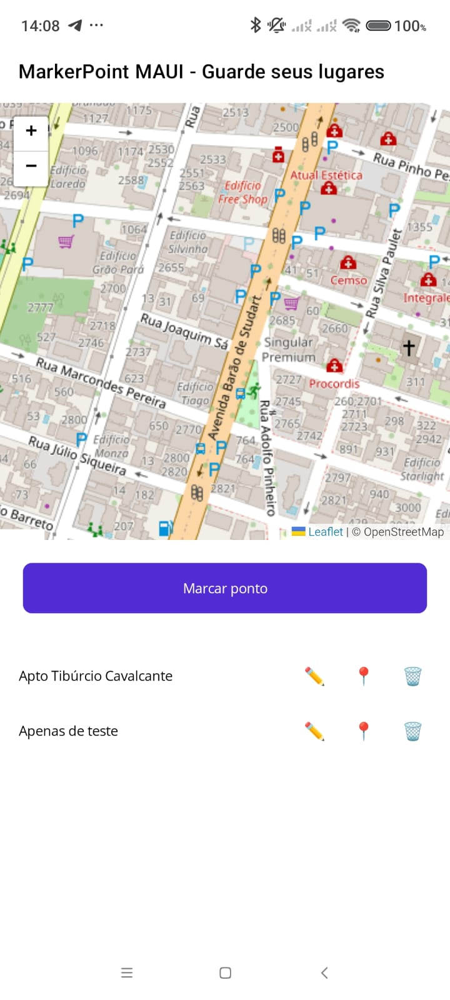

# MarkPointMAUI

## Overview

MarkPointMAUI is a .NET MAUI sample/application that demonstrates a modern cross-platform UI built with .NET 10 and .NET Multi-platform App UI (MAUI). The project is intended as a starting point for developers who want a lightweight, maintainable MAUI app targeting Windows, Android, and iOS (where supported).

This repository contains the application source, XAML UI pages, resources, and platform-specific configuration files required to build and run the app using Visual Studio or the .NET CLI (with the required workloads).

## Technologies

- .NET 10
- .NET MAUI
- C# and XAML
- Visual Studio (recommended) — with .NET MAUI workloads installed
- Platform SDKs (Windows SDK, Android SDK, Xcode for macOS/iOS development)

## Prerequisites

Before building and running the project locally, make sure you have the following installed and configured on your machine:

- .NET 10 SDK: https://dotnet.microsoft.com/download
- Visual Studio 2022/2026 (or later) with the Mobile development with .NET (MAUI) workload
- Android SDK / platform tools (for Android builds)
- For iOS/macOS targets: a macOS machine with Xcode (if you plan to target Apple platforms)

Refer to Microsoft's official .NET MAUI docs for detailed setup instructions:
https://learn.microsoft.com/dotnet/maui/

## Installation / Setup

1. Clone the repository:

   git clone https://github.com/<your-username>/MarkPointMAUI.git
   cd MarkPointMAUI

2. Restore NuGet packages (Visual Studio will also do this automatically):

   dotnet restore

3. Open the solution in Visual Studio:

   - Launch Visual Studio and choose "Open a project or solution".
   - Select the MarkPointMAUI.sln file (or the .csproj in the root if no solution file exists).

4. Ensure required workloads and SDKs are installed in Visual Studio (Mobile development with .NET).

## Build and Run

Recommended: use Visual Studio for the easiest developer experience and device/emulator selection.

1. In Visual Studio select the target platform (Windows Machine, Android Emulator, or a connected device).
2. Set the project MarkPointMAUI as the startup project.
3. Press F5 (Debug) or Ctrl+F5 (Run without debugging).

Alternative (CLI):

1. Restore and build the solution from the command line:

   dotnet restore
   dotnet build

2. For deployment and running, Visual Studio is recommended because it manages device targets and provisioning. CLI run/deploy options depend on the target platform and installed workloads.

## Usage / Examples

- Launch the app on your target platform and interact with the UI.
- Inspect the XAML pages (e.g., MainPage.xaml) to learn how views are composed and how data bindings are wired up.
- Use the project as a template to add pages, services, and platform-specific features.

## Project Structure (typical)

The repository follows a common MAUI layout. Exact file names may vary slightly:

- / (root)
  - README.md
  - readme.png
  - MarkPointMAUI.sln (optional)
  - MarkPointMAUI/ (project folder)
    - MarkPointMAUI.csproj
    - MainPage.xaml
    - App.xaml
    - Platforms/ (platform-specific code for Windows, Android, iOS)
    - Resources/ (images, styles, fonts)
    - Services/ (optional)
    - ViewModels/ (optional)

Explore the repository to find the exact structure used by this project.

## Contributing

Contributions are welcome. To contribute:

1. Fork the repository.
2. Create a feature branch: git checkout -b feature/your-feature-name
3. Make changes in a focused, well-documented commit.
4. Run the application and ensure there are no build errors.
5. Submit a pull request describing the change and why it is useful.

Guidelines:
- Keep changes small and focused.
- Follow existing coding conventions (C#, XAML styles, and folder layout).
- Add or update documentation when introducing new features.
- Open an issue first for larger features or breaking changes so maintainers can provide feedback.

## Contact & Links

- Repository: https://github.com/<your-username>/MarkPointMAUI
- Documentation and official MAUI docs: https://learn.microsoft.com/dotnet/maui/

Replace the links and contact information above with appropriate values for this project or maintainer.

## Challenges & Ideas

Looking for ways to improve this project? Consider the following:

- Add automated UI tests and unit tests for view models and services.
- Integrate CI to build and run tests on push (GitHub Actions).
- Add platform-specific features (native services, notifications, permissions handling).
- Provide sample data and demo flows to showcase app capabilities.
- Improve accessibility and localization support (multi-language resources).

Contributions implementing any of these improvements are highly encouraged.
